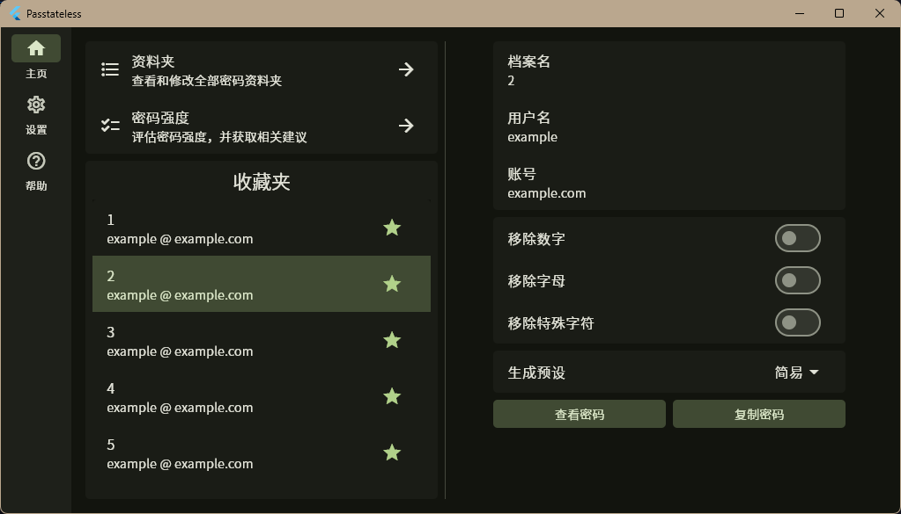
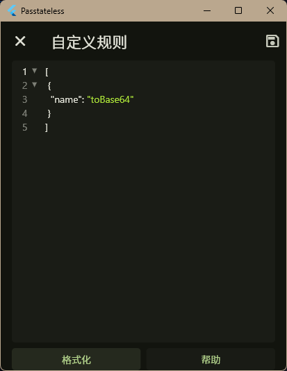
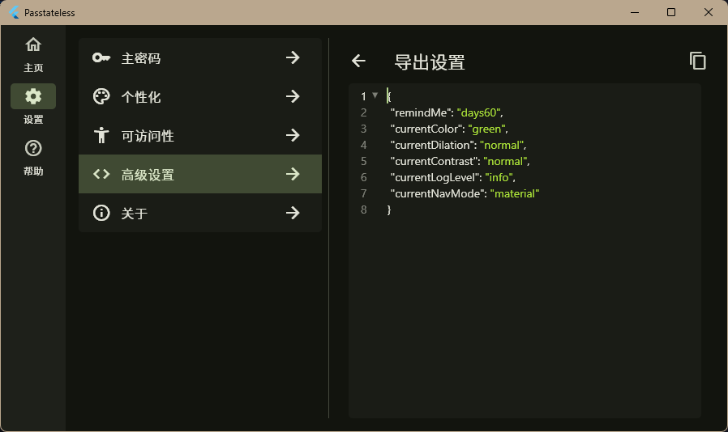
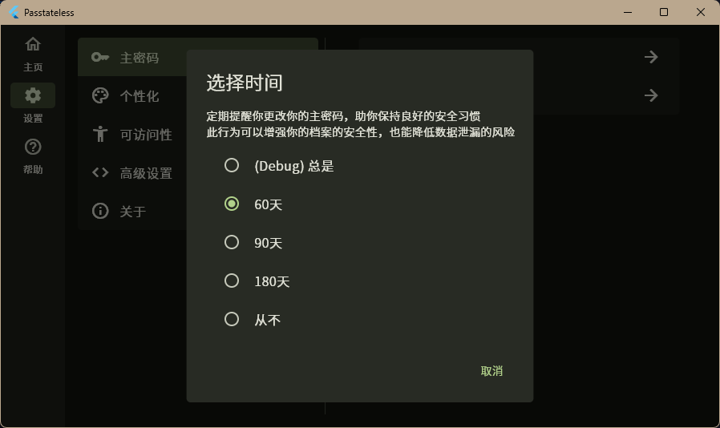

# Passtateless

能够自定义密码生成方式的无状态密码管理器

## ⚠警告⚠

这只是我个人的作业项目，本人并非密码学、计算机安全及其它相关专业学生，无法确保此应用的安全性！  
市面上有很多其他成熟的密码管理器，如果你想在生产环境下要一个密码管理器，你应该去使用它们。  
本人也不对作业项目的维护做任何保证，它随时可能停止维护！  
Use at your own risk！

## 基础功能

就和其他密码管理器一样，管理你的密码。  
具体操作方法可在内置文档中查看。

## 其他功能

### 自定义密码生成算法
具体操作方法可在内置文档中查看。  

### 导入 / 导出设置

### 提醒我更改主密码
