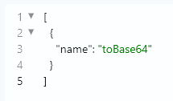

# 格式化与可读性
在编写或修改复杂的 JSON 配置时，数据往往会变成一团挤在一起的“压缩代码”，让人难以理清逻辑层级。为了让你告别眼花缭乱的排查过程，我们在编辑器的可读性方面做了全面的设计。
最直接的利器就是紧挨着**帮助按钮**的**自动格式化**功能。无论你之前是直接粘贴的一行长文本，还是随手敲写的凌乱代码，只需轻轻一点，应用就会瞬间为你理清结构：通过**自动换行**按层级合理拆分数据，根据 `{}` 和 `[]` 的嵌套深度精准补齐**自动缩进**，让所有键值对整齐排列，结构一目了然。
除了主动的格式化，编辑器本身也配备了辅助阅读的底层能力：
*   **语法高亮**：编辑器会自动识别 JSON 的不同数据类型，并为它们赋予不同的颜色标识。例如，键名、字符串值、数字以及布尔值（`true`/`false`）都有专属的配色。这种视觉上的区分能让你在扫视时，瞬间捕捉到关键信息，快速定位拼写错误。
*   **代码折叠**：当你的配置文件越来越庞大、嵌套层级越来越深时，屏幕上的内容难免让人失去焦点。利用代码折叠功能，你可以将暂时不需要关注的数组或对象块“收”起来，隐藏在 `{-}` 或 `[-]` 之中。这不仅极大减少了屏幕上的视觉噪音，还能让你更专注地编辑当前特定层级的配置节点。
    自动格式化搭配语法高亮与代码折叠，让这个小小的编辑框变成了一座结构清晰的“配置大厦”，为你带来更专注、高效的编写体验。  

